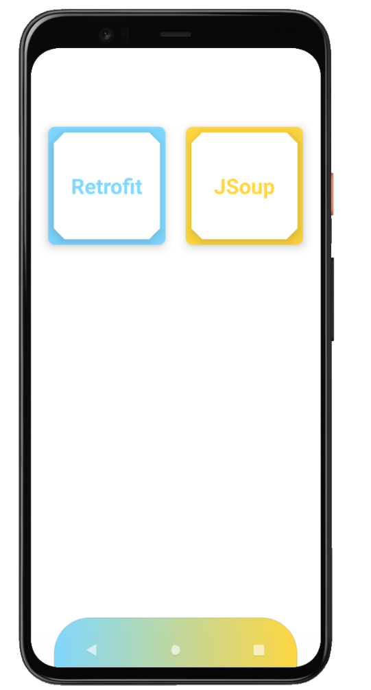

# WebScraping
Exploring different ways to obtain raw HTML from Websites. Initially I'll explore Retrofit and JSoup implementations separately to study the differences on each approach to spot advantages or disadvantages of each. Will decide later how to convert the scrapped data into something useful. This project will also use Dependency Injection using Dagger-Hilt, Coroutines, Navigation, Material Components, ViewBinding and DataBinding.

